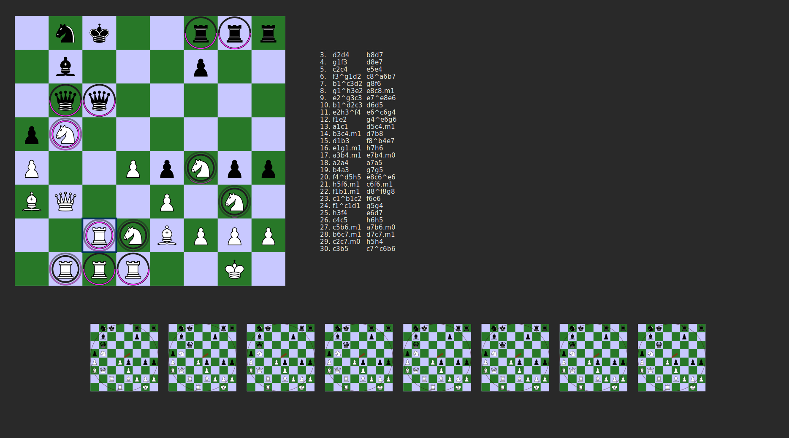
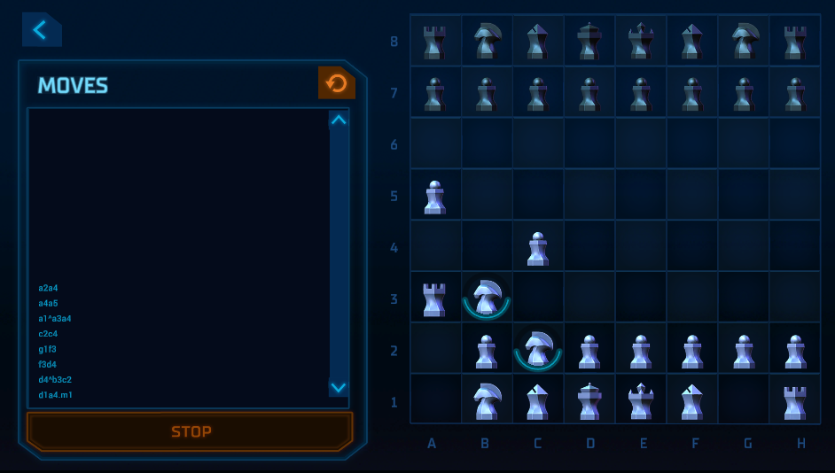

# Quantum Chess



A somewhat hacky implementation of [this paper](https://arxiv.org/pdf/1906.05836.pdf) (made in a week over a holiday).

It's not heavily tested and probably has some bugs still lying around, but it works reasonably well.

Out of respect for the [attempt to monitize](https://quantumchess.net/) quantum chess by the people who invented the rules, `chess.rs`, `term.rs`, and `druid.rs` are (temporarily?) *not* publicly licensed apart from the license required by githubs TOS. That means you can clone and fork this repo (github's TOS), you can build and privately run the executable in most jurisdictions (that's just not copyright infringment), you can not publicly perform the work, redistribute those files, or do most other things with them.

`gates.rs`,` `qcomp.rs`, and `qcomp_explainable.rs` are released under both MIT and Apache2 licenses, to match up with the rest of the rust ecosystem.

The svg files were borrowed from [wikimedia commons](https://commons.wikimedia.org/wiki/Category:SVG_chess_pieces) and are licensed CC-BY-SA-3.0.

# Usage

Install [rustup](https://rustup.rs/), then

```
git clone https://github.com/gmorenz/qc
cd qc
rustup override set nightly-2020-12-23

# If you have awhile (8m on my desktop), a few gb of memory, and want a much smaller much faster binary
cargo run --bin qc-druid --release -- 10 # 10 is the seed for the random number generator, use any positive integer < 2^64.
# If you're impatient (1-2m) or don't have quite that much memory to build
cargo run --bin qc-druid -- 10
```

Note that it will take a few minutes to build, this is primarily because of alloc_qubit (see theoretical roadmap for more information).

## Controls and Rules

Read the paper for the full rules, but here's the short and only approximately correct version:

 - Normal chess moves are legal moves, left click on the piece you want to move and left click on the square you want to go to.
 - Non pawns can "split" into two copies each with 50% probability of being there, left click on the piece you want to move, right click on the first square you want to go to, left click on the second square you want to go to.
 - Non pawns can "merge" two squares possibly containing the same kind of piece into one square, right click on the first square you want to merge, left click on the second square you want
   to merge, and left click on where you want to merge to (and note this still has to be a legal move!).
 - You cannot capture a piece when splitting or merging a piece, or move onto one of your own pieces of a different type.
 - Each square can only contain a single type/color of piece, if you make a move that would violate this, we will make a measurement of some kind to find out which piece is actually in a square as part of your move.

The circles around pieces represent the probability of that piece being there. When you click on a piece we draw smaller circles representing the probability of each piece being there given the piece that you clicked on is actually there.

The question of whether or not a square is occupied is quantum in quantum chess, everything else (piece type, whose turn it is, can you castle, etc) is classical. A quantum state^1 is a vector 2^(# qubits) dimensional complex vector. The n^th element of this vector represents the state where the (q)bits that are '1' in 'n' are true, and the (q)bits that are `0` in `n` are false. In our case the first 64 qubits represent the board's occupancy, so for example the 0xff_ff_00_00_00_00_ff_ff^th element represents the "starting state" where nothing has moved. The squared magnitude of the complex number in the element is the probability that we are in that state, and the direction is the "phase" which matters when we try and add up phases (commonly seen in merge moves!). At the bottom of the window is a series of boards representing these vector elements. Every non-zero element has a board, and top of it is a line in a circle representing the complex number. If that doesn't make sense, play around a bit and see if you can figure out what I mean, and if that doesn't work feel free to shoot me an email (I'm struggling to make this explanation both digestible and not assume too much knowledge of quantum computing).

If you run the game from a terminal and watch the output you can see a bit of a verbose description of what is happening - notably including long form descriptions of what is being measured and the probability of measurements (both of which I would like to include in the UI in some formgiven more time to work on this).

^1 We only discuss "pure states" here.

## (Arguable) differences from the paper

Split and merge moves are implemented in the form of "controlled unitaries" controlled by path ancilla qubits
made up of the path between the destination and the source. I made the choice to never include any of the squares
directly involved in the move on the path. I.e. in `e2^e4e6` the path from `e2` to `e6` is just `e3` and `e5`.
This appears to match the https://quantumchess.net/play/ implementation, and makes merge moves act more like
I expect.

## Differences from the https://quantumchess.net/play/ implementation

The https://quantchess.net/play implementation appears to implement additional move legality checking, which
checks that a move could possibly complete before allowing it. For example after `g1^f3h3`, `d1f3` is still
disallowed because it is moving through a (definitely there) pawn. In this implementation (and in my reading of
the paper) `d1f3` is allowed because it is a legal chess move for the queen on `d1`, and it changes the state
when it measures whether or not `f3` is present. This is suboptimal from a game design perspective, and if I
was going to spend more time on this I might consider rule changes to check whether there is any possibility
of the move completing before measuring `f3`. However I would probably not go with the https://quantumchess.net/play
implementation because it does not check this completely, e.g. the following sequence of moves (all for white)
measures the rook on a4 on the last move despite the d1a4 move not being able to sucesfully complete:
`a2a4, a4a5, a1^a3a4, c2c4, g1f3, f3d4, d4^b3c2, d1a4.m1` .

The https://quantchess.net/play implementation appears to make a different measurement than me at the end of
the move sequence `e2e4 e7e5 f1^d3c4 b8^a6c6 d3a6.m?` - perhaps somehow "knowing" that the two bishops
resulting from the `f1^d3c4` split can't collide when making the decision of what to measure? It seems to me
that my implementation matches the paper.

# Source Code Tour

Note that this was as much an excuse to experiment with const-generics and druid as anything else, which is reflected in the code a fair bit.

There are four files

 - qcomp.rs: This is our bespoke quantum computer simulator, it should be reasonably efficient and fast. Quantum states are represented as a `HashMap<BasisVector, Complex>`. We make heavy use of rust's experimental const generics to make it so that `BasisVector` is stored efficiently and does not need to allocate (though in reality we could probably achieve similar performance by just storing it as a `u256`) - moreover every function is monomorphized for the number of qbits/length of `BasisVector` which should lead to very fast code generated by the compiler. The tradeoff we pay for this is long compile times, a bit of awkward boiler plate to call the functions, and that we have to explicitly list out each number of qubits supported (in the definition of `with_bound_const`). We also have some qubit allocation/deallocation code here that should maybe be refactored out.

 - qcomp_explainable.rs: This file exists to help track what qubits in `qcomp.rs` mean, and generally be less "pure" about avoiding allocations and hyper optimized code. We also take advantage of it to hide some of the weird boiler plate generated by `qcomp.rs`.

 - gates.rs: This is a library of unitaries.

 - chess.rs: This implements the rules of quantum chess. `apply_move` is the main coordinator function and would be a good place to start reading. We take a `Move`, check that it is legal, map it to a `QuantumMove` (i.e. a kind of transformation to apply), apply it, check if it changed anything, and if it did update the remaining classical game state.

 - druid.rs: This implements a GUI for quantum chess using the druid gui framework (which is not production ready, but is pretty nice).

 - term.rs: This implements a terminal interface for quantum chess.

# Theoretical Roadmap

I don't really anticipate coming back to this project and further improving it - it was just a week long diversion over the holiday's. If I do though there are a number of things that could be improved:

## Just Programming

 - Code cleanliness - this was written fast and hacky - there's a lot that could be improved

### Chess Related

 - An option for exact arithmetic, this would be much slower (in the general case it requires allocation, I might try and use pointer packing tricks to avoid allocation in the common case though).
 - An undo button, there are two general approaches to this:
   1. Rerun all the moves from the start and force measurements to measure the same way
   2. Invert gates, and store "thrown out" measured states
   The first is slow, the second suffers from accuracy problems and could bloat memory usage in long games. Either could work.
 - Show fully captured pieces in the list of captured pieces
 - Add in UI for promoting to pieces other than pawns.
 - Make it illegal to move a pawn to the 8th row and *not* promote.
 - Only show ".m0"/".m1" when any other measurement was actually a possibility.

 ### Just qcomp related

 - The interface for controlled matricies is really clunky (but concise), and not as efficient as I'd like for huge states (wasting comparisons). Consider moving the control part to some sort of generic parameter.
 - Figure out a benchmark, for "reasonably computational-basis-aligned states" I think this should be very fast
 - Pass in matricies as const generic parametrs, it is my belief (that I would want to see benchmarks on) that this would lead to significantly faster code.
 - Reduce quadratic code size (in #qbits) to linear, specifically `alloc_qubit` is currently quadratic and could probably be linear with some clever use of specialization (I believe everything else is already linear).
 - Split this out into a seperate crate.

## Higher level work

 - The UI around selecting squares could be refined significantly, probably split into an "analysis" and a "move" mode, and disallow selections that don't lead to a legal move in the "move" mode.
 - Some form of description (in the UI) of what happened on any given move, maybe something like showing a quantum circuit diagram, or a table of how effected qubits were changed depending on their occupancy, in the top right, selectable by clicking on a move in the move history. Also nice would be the ability to view old positions/list of states.
 - A better way of visualizing "phase" for users.
 - Modify the move rules to only measure when it is actually necessary (not, e.g., on fully blocked moves).
 - More complete "garbage collection" for qubits:

   We have a concept of "freed" qubits, which lists qubits which we don't change anymore and allows the implementation to re-use their memory once they are no longer needed to describe the state of the non-free qubits (note that we only use pure states). We don't do a very good job of actually detecting when they are no longer needed however - we only detect that if they are always 0 or always 1 (in every state).

   We should also look for groups of free qubits that are now "factorizable" from the remaining qubits, at which point we could re-use all of those qubits after zeroing them in the bv.

   We should also detect when two free qubits of the same type (e.g. "Captured Black Queen") are redundant and can be merged.
   For instance if the state no longer depends on whether the queen was captured on move a or move b, but it does depend on whether or not it was captured, we would like to merge the "captured" qubits from move a and move b into a single qubit.
 - AI? There are two plausible approaches here that I have vaguely considered. Something like mu zero that doesn't need a full representation of the game and feeding it a view similar to the UI, or something like alpha zero and running it on randomly selected basis vectors from the state. The latter is probably slower, but given enough time might become more accurate as it is better able to "see" enanglement (it is still missing phase though).
